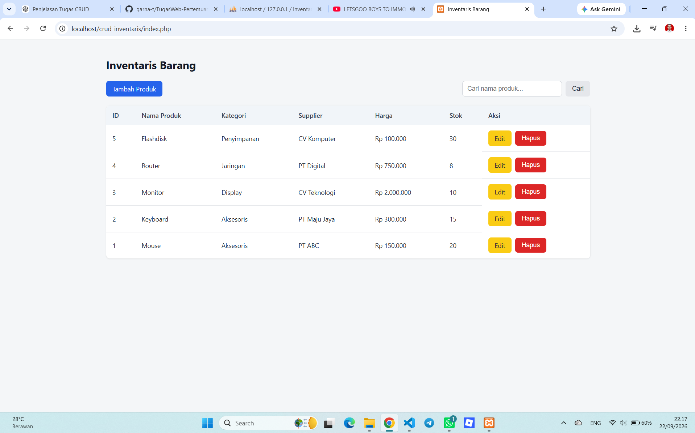
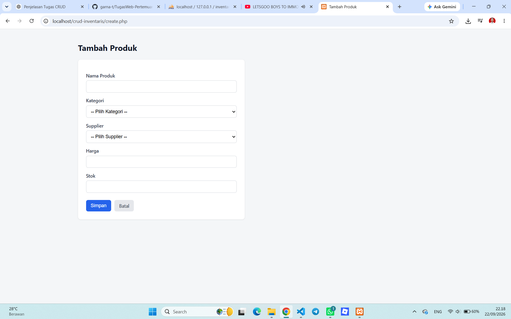
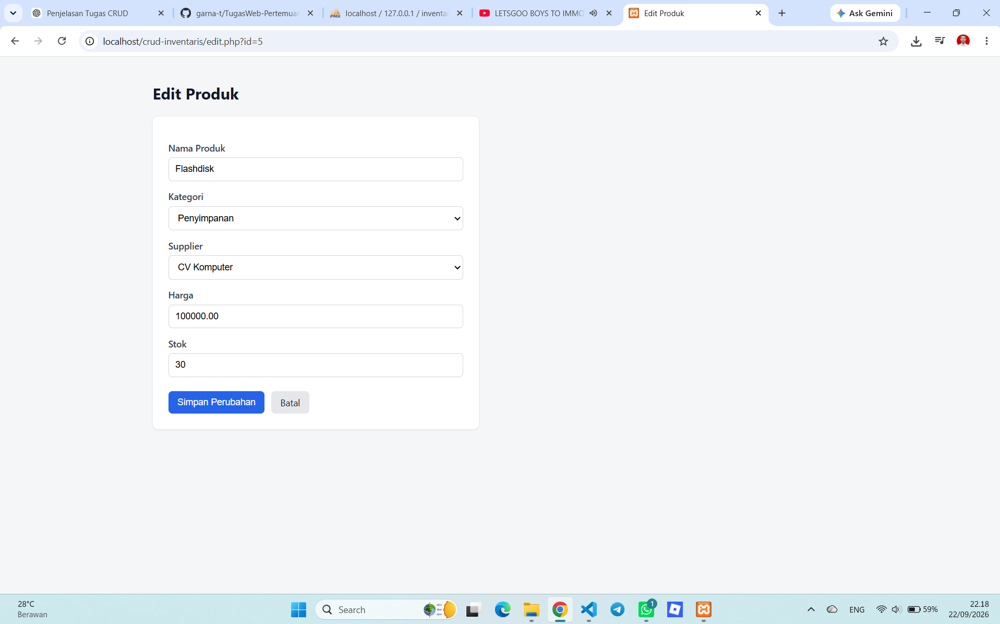

# Tugas Rutin 8 - CRUD Inventaris Barang

Aplikasi CRUD Inventaris Barang berbasis PHP dan MySQL menggunakan PDO. Project ini dibuat untuk memenuhi Tugas Rutin 8 pada mata kuliah Pemrograman Web dengan menerapkan konsep RDBMS, desain database relasional, normalisasi, CRUD, prepared statement, dan keamanan dari SQL Injection.

---

## Identitas

**Nama:** GANDI ARMANA TARIGAN 
**Mata Kuliah:** Pemrograman Web  
**Tugas:** Tugas Rutin 8 - CRUD Inventaris Barang  
**Repository:** TugasWeb-Pertemuan8-CRUD

---

## Deskripsi Project

Aplikasi Inventaris Barang merupakan aplikasi sederhana untuk mengelola data barang yang tersimpan di dalam database.

Aplikasi memiliki tiga tabel utama, yaitu:

- `categories` untuk menyimpan data kategori barang.
- `suppliers` untuk menyimpan data supplier.
- `products` untuk menyimpan data produk.

Tabel `products` memiliki hubungan dengan tabel `categories` dan `suppliers` melalui Foreign Key.

Aplikasi menyediakan fungsi utama CRUD (Create, Read, Update, Delete) untuk mengelola data produk.

---

## Fitur Aplikasi

Fitur yang terdapat pada aplikasi ini meliputi:

1. Menampilkan daftar produk.
2. Menampilkan kategori dan supplier menggunakan JOIN.
3. Menambahkan produk baru.
4. Mengubah data produk.
5. Menghapus produk.
6. Pencarian produk berdasarkan nama produk.
7. Dropdown kategori pada form produk.
8. Dropdown supplier pada form produk.
9. Validasi input.
10. Koneksi database menggunakan PDO.
11. PDO menggunakan pola Singleton.
12. Prepared Statement untuk query yang menerima input pengguna.
13. Pencegahan SQL Injection.
14. Penggunaan `htmlspecialchars()` pada output HTML.
15. Flash message setelah proses berhasil atau gagal.
16. Redirect setelah proses CRUD.
17. Konfirmasi sebelum menghapus data.
18. Tampilan antarmuka menggunakan HTML dan CSS.

---

## Teknologi yang Digunakan

Project ini menggunakan teknologi berikut:

- PHP
- MySQL
- PDO
- HTML5
- CSS3
- XAMPP
- phpMyAdmin

---

## Struktur Project

```text
crud-inventaris/
│
├── config/
│   └── database.php
│
├── assets/
│   └── style.css
│
├── index.php
├── create.php
├── edit.php
├── delete.php
├── schema.sql
├── README.md
│
├── screenshot-home.png
├── screenshot-create.png
└── screenshot-edit.png

## Screenshot

### Halaman Utama



### Form Tambah Produk



### Form Edit Produk


